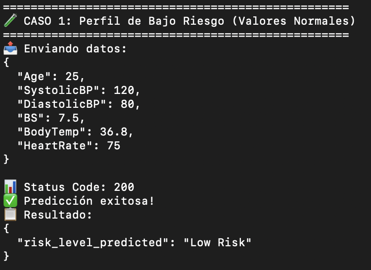

# Tarea-2-DPyPD

## Despliegue de un Modelo de Predicción de Riesgo en el Embarazo

Este repositorio contiene una API, construida con FastAPI, para predecir el nivel de riesgo en el embarazo (`High Risk`, `Mid Risk`, `Low Risk`) a partir de datos de salud de la paciente. El modelo de Machine Learning fue entrenado previamente y se despliega como un servicio web. La API estará desplegada en Render.

### I. Puesta en Marcha del Proyecto:

Para ejecutar este proyecto de manera local, sigue estos sencillos pasos:

1. **Clonar el repositorio**:
   ```bash
   git clone https://github.com/pablo-mada/Tarea-2-DPyPD.git

   cd Tarea-2-DPyPD
   ```

2. **Crear un entorno virtual**: Es una buena práctica aislar las dependencias del proyecto. Puedes crear y activar un entorno virtual con estos comandos:

   ```bash
    # Crear el entorno virtual
    python3 -m venv venv
    # Activar el entorno virtual (en Windows)
    venv\Scripts\activate
    # Activar el entorno virtual (en macOS/Linux)
    source venv/bin/activate
   ```
3. **Instalar las dependencias**: Con el entorno virtual activado, instala todas las librerías necesarias listadas en el archivo `requirements.txt`:
   ```bash
   pip install -r requirements.txt
   ```

### II. Estructura del Proyecto
El proyecto está estructurado de la siguiente manera:

- `main.py`: Archivo principal de la API de FastAPI.

- `maternal_health_risk_model_v2.joblib`: Modelo de Machine Learning serializado.

- `client.py`: Script de Python para probar la API desde un cliente externo.

- `requirements.txt`: Archivo con las dependencias necesarias.

- `README.md`: Este archivo.

- `reports`: Carpeta con petiones en bash.


### III. Ejecución Local de la API

Para iniciar el servidor de la API en tu máquina local, asegúrate de que tu entorno virtual esté activado y ejecuta el siguiente comando:

```bash
uvicorn main:app --reload --host 127.0.0.1 --port 8000
```

Una vez que el servidor esté en funcionamiento, la documentación interactiva de la API estará disponible en http://127.0.0.1:8000/docs.

### IV. Endpoints de la API
La API expone un único endpoint para realizar predicciones.

Endpoint `/predict`

- Método: `POST`

- URL: `https://maternal-health-risk-api.onrender.com/predict`

- Descripción: Recibe un objeto JSON con los datos de salud de la paciente y retorna el nivel de riesgo predicho.

**Estructura del JSON de entrada (Payload):**

Se espera un objeto JSON con las siguientes claves y tipos de datos:

| Campo | Tipo | Descripción | Validaciones |
|:------|:----:|:------------|:-------------|
| `Age` | `integer` | Edad en años de la paciente | 13 ≤ valor ≤ 60 |
| `SystolicBP` | `integer` | Presión arterial sistólica en mmHg | 70 ≤ valor ≤ 250 |
| `DiastolicBP` | `integer` | Presión arterial diastólica en mmHg | 40 ≤ valor ≤ 150 |
| `BS` | `float` | Nivel de glucosa en sangre en mmol/L | 3.0 ≤ valor ≤ 25.0 |
| `BodyTemp` | `float` | Temperatura corporal en grados Celsius | 35.0 ≤ valor ≤ 42.0 |
| `HeartRate` | `integer` | Frecuencia cardíaca en latidos por minuto | 40 ≤ valor ≤ 200 |


**Ejemplo con curl:**

Abre otra ventana de la consola en la ubicación del proyecto, con el entorno activado y ejecuta lo siguiente:

```bash
curl -X POST "https://maternal-health-risk-api.onrender.com/predict" \
     -H "Content-Type: application/json" \
     -d '{"Age": 23, "SystolicBP": 130, "DiastolicBP": 70, "BS": 7.0, "BodyTemp": 37.0, "HeartRate": 78}'
```

Se debería obtener como respuesta:

```bash
{"risk_level_predicted":"Mid Risk"}
```

### V. API Desplegada en Render

La versión productiva de esta API está desplegada y accesible públicamente en la siguiente URL:

URL de la API: [\[URL pública de tu API en Render\]](https://maternal-health-risk-api.onrender.com/docs)


**Ejemplo de Petición Válida:**

```json
{
  "Age": 23,
  "SystolicBP": 130,
  "DiastolicBP": 70,
  "BS": 7.0,
  "BodyTemp": 37.0,
  "HeartRate": 78
}
```

**Ejemplo de Respuesta:**

```json
{
  "risk_level_predicted": "Mid Risk"
}
```


### VI. Pruebas de la API con el Cliente

Para verificar que la API funciona correctamente, puedes ejecutar el script `client.py` provisto en este repositorio. Este script realiza tres peticiones validas y dos con errores a la API desplegada y muestra las entradas y salidas correspondientes.

Para ejecutar el script, navega al directorio del proyecto con el entorno activado y ejecuta el siguiente comando:
   ```bash
   python client.py
   ```

Como resultado, se mostrarán las respuestas de las cinco peticiones realizadas, incluyendo el nivel de riesgo predicho para cada caso y los errores cuado corresponda. Por ejemplo:


---



---


---
